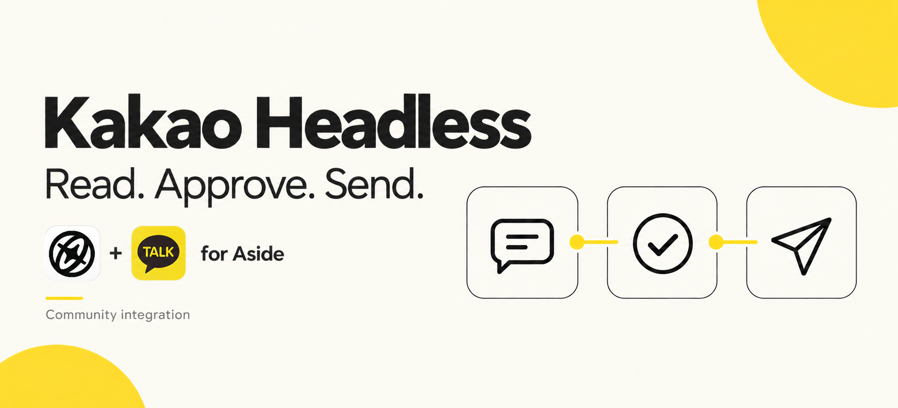

# Kakao Headless

**Read KakaoTalk, approve text or one image, and let your agent make one guarded send attempt. No app UI automation.**

[](https://github.com/JSap0914/kakao-headless/actions/workflows/ci.yml)
[](https://github.com/JSap0914/kakao-headless/releases)
[](LICENSE)
[](#requirements)

Kakao Headless connects a local agent to existing KakaoTalk rooms through a CLI. Find the right conversation, read its messages, review the recipient and approved text or image, then make one guarded send attempt. If a response is ambiguous, verify history instead of sending again.

It uses the pinned `agent-messenger` LOCO provider and adds credential storage, recipient checks, send reservations and verification. A community integration for Aside, not an official Kakao or Aside product.

## Install → connect → use

### 1. Install the CLI

```sh
npm install -g --ignore-scripts \
  https://github.com/JSap0914/kakao-headless/releases/download/v0.3.0/jsap0914-kakao-headless-0.3.0.tgz \
  agent-messenger@2.37.1
kakao-headless doctor
```

Packages are distributed through **GitHub Releases**, not the npm registry. The protocol provider is installed separately; review [third-party notes](THIRD_PARTY.md) before use. Do not install the unrelated empty `agent-kakaotalk@0.0.1` package.

If your global npm directory is not writable, add `--prefix "$HOME/.local"` to the install command and use `"$HOME/.local/bin/kakao-headless"` instead of the bare command. No `sudo` is required.

### 2. Connect your Aside account

```sh
kakao-headless aside install --account 0
kakao-headless aside doctor --account 0
```

That's the skill installation. **No manual `cp`, internal `node_modules` path or maintainer-specific account configuration.**

`0` is an example of **your local Aside account slot**, not a Kakao user ID. Choose the slot you use. For a nonstandard account location, pass `--account-root /absolute/path/to/account` as well. The account directory must already exist.

The installer records the exact Node/CLI paths, adds one user skill and a small ownership manifest, and preserves files you have edited. It does not touch account credentials, settings, built-in skills or `AGENTS.md`. Run `aside install` again after upgrading; `aside doctor` reports missing, modified or outdated files. `aside uninstall --account 0` removes only unchanged files owned by this integration.

### 3. Authenticate your Kakao account

Run these in a local interactive terminal:

```sh
kakao-headless auth begin --email YOU@example.com --ack-risk
# Confirm the registration code on your phone, then:
kakao-headless auth finish --ack-risk
```

Passwords are entered without echo and are never saved. Keep passwords and phone codes out of agent chats, shell arguments and logs. Initial setup needs normal macOS Keychain permission; occupied device slots are not forcibly replaced.

> **Unofficial client warning:** Kakao may restrict accounts that use unofficial protocol clients. Start with a test account. This tool does not provide an account-safety guarantee.

## What you can do

| Command | What it does |
|---|---|
| `chats --search NAME` | Find existing rooms by name |
| `history CHAT_ID --count 30` | Read messages without issuing mark-read commands |
| `history CHAT_ID --from LOG_ID` | Read forward from an exact message ID |
| `preview CHAT_ID --text-file FILE --ack-risk` | Bind an approval preview to account, room, members and exact text |
| `preview CHAT_ID --image-file FILE --ack-risk` | Validate and privately copy one eligible image, then bind it to an approval preview |
| `send PREVIEW_ID --confirm --ack-risk` | Revalidate account and room, reserve the attempt durably, then send the preview's text or image once |
| `receipt PREVIEW_ID` | Inspect the original result and any later verification |
| `reconcile PREVIEW_ID --log-id LOG_ID` | Verify an ambiguous send through history, without resending |
| `auth refresh` | Rotate the token and persist encrypted credentials |

Network/authentication operations require `--ack-risk`. `doctor`, `receipt` and `aside` management are offline operations.

### Read

```sh
kakao-headless chats --search 'Room name' --ack-risk
kakao-headless history 'CHAT_ID' --count 30 --ack-risk
```

### Approve and send text

```sh
printf '%s' 'This is one test message. No reply needed.' > message.txt
kakao-headless preview 'CHAT_ID' --text-file message.txt --ack-risk
# Review the exact room, member IDs and message. Then explicitly approve:
kakao-headless send 'PREVIEW_ID' --confirm --ack-risk
kakao-headless receipt 'PREVIEW_ID'
```

### Approve and send one image

```sh
kakao-headless preview 'CHAT_ID' --image-file FILE --ack-risk
# Review the exact room and image metadata. Then explicitly approve:
kakao-headless send 'PREVIEW_ID' --confirm --ack-risk
kakao-headless receipt 'PREVIEW_ID'
```

An image preview accepts exactly one PNG or JPEG file, at most 10 MiB, with each dimension at most 20,000 pixels and at most 100 million pixels total. PNG/JPEG structure and headers are checked, but the file is not fully decoded. The preview creates a private immutable generic-named `.image.bin` copy with mode `0600`; it does not retain or expose the source filename or path. Original bytes, including any embedded EXIF or other metadata, are preserved. Remove sensitive metadata before creating the preview. Captions, galleries, video, audio and other attachments are unsupported.

### Reconcile instead of retrying

```sh
# Find the exact own-message ID in history first.
kakao-headless reconcile 'PREVIEW_ID' --log-id 'LOG_ID' --ack-risk
```

This checks the sender, recipient, log ID, message type and attempt-time window, and checks exact text for text previews. For image previews it checks the preview-bound SHA-256 and the exact own-history image fingerprint: SHA-1, size, dimensions, MIME type, plus an optional server key when present. The original response stays intact; separate history evidence is added. It never invokes a send operation.

## Why the extra checks?

A network error does not mean a message was not sent. A response can be lost after the server has accepted it.

- A preview lasts ten minutes and is bound to the account and recipient snapshot. An image preview is also bound to the SHA-256 of its immutable private copy.
- The account and room are revalidated, then a durable reservation is saved **before** any `SHIP` or `POST` operation.
- One preview has one raw provider path: `SHIP` → `POST` → stream → `COMPLETE`. The CLI never calls a high-level retrying send API and never performs an extra write.
- The same preview cannot be retried after a crash, rejection, unknown result or an ambiguous response.
- Packet/body status and IDs are validated; own-history verification is distinct from server acceptance.

This is **at-most-one local attempt per preview**, not guaranteed exactly-once delivery. Deleting state, using another client or creating another preview is outside that protection. A history match is not a recipient read receipt.

| Result | Meaning |
|---|---|
| `verified` | Response and exact own-history entry matched |
| `accepted_unverified` | Accepted response, history not confirmed |
| `unknown` | Missing/malformed response; do not retry blindly |
| `rejected` | Explicit rejection or pre-write validation failure |
| `verification.status: history_verified` | Read-only follow-up verified the message; original result preserved |

Exit codes: `0` successful command, `1` validation/runtime failure, `2` send not history-verified. A nonzero send exit is **not** permission to retry.

## Your account, your machine

The `@jsap0914` package scope identifies the publisher. **It does not connect anyone to the maintainer's account.** Each installation authenticates its own Kakao account and stores its own data locally.

- Initial authentication secret: macOS Keychain.
- Rotated credentials: AES-256-GCM local envelope, protected by a key derived from the Keychain secret.
- State: `~/.local/state/kakao-headless`, directory `0700`, files `0600`.
- Previews: plaintext text or a private immutable image copy, member IDs and metadata. Keep private state out of Git and shared folders.

Back up the Keychain root and encrypted credentials together. `auth logout` deletes local credentials, not the remote session, and requires Keychain deletion permission. Serialize credential-changing commands; concurrent refreshes across processes are unsupported.

## Requirements

- macOS for real-account use and Keychain access
- Node.js 22.13+
- Apple command-line tools (`xcode-select --install`)
- The separately installed `agent-messenger@2.37.1` provider

## Development

```sh
git clone https://github.com/JSap0914/kakao-headless.git
cd kakao-headless
npm ci --ignore-scripts
npm test
# With the optional pinned provider installed:
TEST_PROVIDER=1 npm test
```

The CLI works on its own; Aside is an optional integration. Its installer adds a user skill, not a send method to Aside's built-in `kakaotalk` REPL global.

[Architecture](docs/SPEC.md) · [Security](SECURITY.md) · [Validation](docs/VALIDATION.md) · [Brand assets](assets/README.md) · [MIT license](LICENSE)
